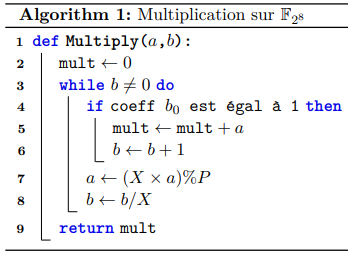

Le module d'un polynome en $F_{2^8}$ par un polynome de même degré peut être obtenu en prenant la représenation des polynomes en bits et en faisant un XOR entre les bits des deux polynomes. Le résultat est un polynome de degré $7$ .

Globalement si $a$ et $b$ sont deux polynomes de degré $7$ en $F_{2^8}$, alors le module $a \text{ mod } b$ est donné par $b_a \oplus b_b$ où $b_a$ et $b_b$ sont les représentations binaires de $a$ et $b$ et $\oplus$ est le XOR bit par bit.

Concept vient du devoir 2 de LEPL1108 :
<details>
<summary>PDF du devoir</summary>
<div>
<object data="./devoir2.pdf" type="application/pdf" style="height:100vh;width:100%">
</object>
</div>
</details>

L'algorithme suivant pour la multiplication dans $F_{2^8}$ :
<p></p>

Peut être implémenté en python comme suit :
```python
def multiply(self, x, y, pol):

    a = int(x, 2)
    b = int(y, 2)
    p = int(pol, 2)

    product = 0

    while b:
        if b & 1:
            product ^= a
            b ^= 1
        a <<= 1
        if a & 256:
            a ^= p
        b >>= 1

    return self.toBinary(product)
```

## Preuve :
TODO

(Note to self : pour la preuve, il suffit d'utiliser la division euclidienne pour un polynome général et de montrer que le reste est bien donné par XOR)